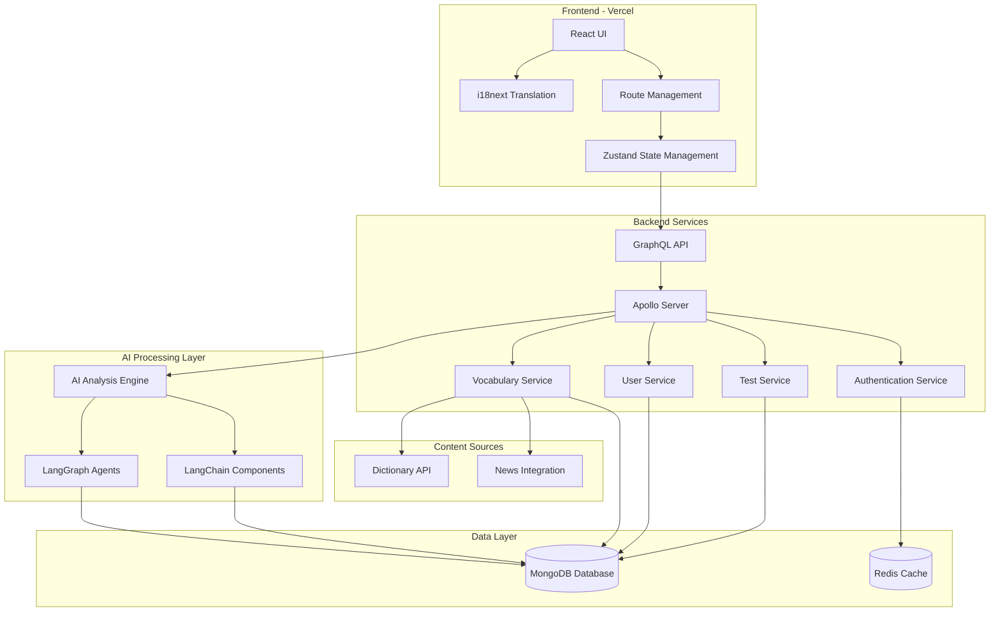

# VocabMaster: AI-Powered Vocabulary Learning Platform

An intelligent platform for enhancing vocabulary learning through adaptive tests, performance tracking, and AI-driven analysis.

## Features

- 🧠 Customized vocabulary tests (MCQ, matching, fill-in-blanks)
- 📊 Test history and performance tracking
- 🤖 AI-powered performance analysis reports
- 📈 User ability estimation and learning path recommendations
- ⚡️ Adaptive testing that adjusts to user skill level
- 🔄 Real-time feedback and improvement suggestions
- 🌐 Full internationalization support (Chinese and English)
- ♿ Accessible design for all users

## Live Demo

### Frontend
🚀 **Check out the live application**: [VocabMaster on Vercel](https://vibe-coding-vocabs-learner.vercel.app/)

Experience the latest version of VocabMaster in action! The demo showcases the current UI components, authentication flow, and dashboard features.

### Backend API
🔌 **Production API Endpoint**: [https://vibe-coding-vocabs-learner-server.onrender.com/graphql](https://vibe-coding-vocabs-learner-server.onrender.com/graphql)

The GraphQL API is deployed on Render and serves as the backend for the VocabMaster application. You can explore the API using the GraphQL playground at this endpoint.

#### Health Check
🩺 **API Health Check**: [https://vibe-coding-vocabs-learner-server.onrender.com/health](https://vibe-coding-vocabs-learner-server.onrender.com/health)

Use this endpoint to verify the API's operational status. Returns basic health metrics and connection status.

## Tech Stack

- **Frontend**: 
  - ReactJS with React Router for navigation
  - Zustand for state management
  - i18next for internationalization
- **Backend**:
  - GraphQL API
  - Apollo Server
  - MongoDB for data storage
  - Express.js web framework
- **Styling**: TailwindCSS for responsive design
- **AI Integration**: 
  - LangChain for building AI workflow components
  - LangGraph for creating dynamic agent-based systems
- **Testing**:
  - Jest and React Testing Library
  - Cypress for end-to-end testing
- **Development**:
  - TypeScript for type safety
  - Vite for fast development and bundling
- **Deployment**:
  - Docker for containerization
  - Docker Compose for multi-container deployment
  - Render for production API hosting

## System Architecture



## Getting Started

### Prerequisites

- Node.js 18+ installed
- Yarn or npm for package management
- Docker and Docker Compose (for containerized deployment)

### Installation

Install the dependencies:

```bash
npm install
# or
yarn
```

### Development

Start the development server with HMR:

```bash
npm run dev
# or
yarn dev
```

Your application will be available at `http://localhost:4000/graphql`.

## Docker Setup

### Running with Docker Compose (Production)

The easiest way to run the VocabMaster backend is with Docker Compose. This will start both the API server and MongoDB database in containers:

1. Create a `.env` file based on the `.env.example` template:

```bash
cp .env.example .env
```

2. Modify the values in the `.env` file as needed, especially the `JWT_SECRET`.

3. Start the application with Docker Compose:

```bash
docker-compose up -d
```

This will:
- Build the API server image
- Start a MongoDB container
- Connect the API server to MongoDB
- Expose the API on port 4000

4. To stop the application:

```bash
docker-compose down
```

### Development with Docker

For development with hot-reloading:

1. Use the development Docker Compose configuration:

```bash
docker-compose -f docker-compose.dev.yml up
```

This will:
- Mount your source files into the container
- Start the application with nodemon for hot-reloading
- Set NODE_ENV to development
- Keep the console output visible for debugging

2. Any changes you make to the source files will automatically restart the server.

3. To stop the development environment:

```bash
docker-compose -f docker-compose.dev.yml down
```

### Building and Running the Docker Image Directly

If you prefer to manage MongoDB separately, you can build and run just the API server container:

1. Build the Docker image:

```bash
docker build -t vocabmaster-api .
```

2. Run the container:

```bash
docker run -p 4000:4000 \
  -e MONGODB_URI=mongodb://your-mongodb-host:27017/vocabmaster \
  -e JWT_SECRET=your_jwt_secret_key_here \
  -e PORT=4000 \
  -d vocabmaster-api
```

## Building for Production

Create a production build:

```bash
npm run build
# or
yarn build
```

## Deployment

The frontend application is deployed using Vercel. The backend can be deployed using Docker containers on platforms that support Docker deployments (AWS ECS, Google Cloud Run, etc.).

---

Built with ❤️ by VocabMaster Team
